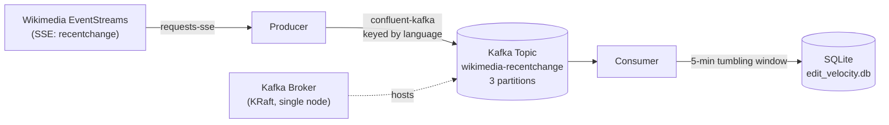

# Wikimedia Kafka Streaming Pipeline

Real-time edit velocity by language, streamed from Wikipedia's live edit feed through a
self-hosted Kafka cluster, aggregated in 5-minute tumbling windows — Python producer, Python
consumer, KRaft-mode broker, Dockerized, tested, CI'd.


## What this is

A streaming pipeline that ingests Wikipedia's live edit feed via Wikimedia's public
[EventStreams](https://wikitech.wikimedia.org/wiki/Event_Platform/EventStreams) API, publishes
it to a single-node Kafka cluster running in KRaft mode (no ZooKeeper), and aggregates edit
velocity by language in real time — no Kafka Streams, no Flink, no third-party stream-processing
framework. The windowing logic is plain Python, built by hand, because Kafka Streams' windowed
aggregation is JVM-only with no official Python port.

Companion piece to [`aws-financial-data-lake`](https://github.com/aksalunke/aws-financial-data-lake) and [`tfl-airflow-dbt-pipeline`](https://github.com/aksalunke/tfl-airflow-dbt-pipeline) — same engineering discipline (real data over assumptions, honest documentation of trade-offs, tested failure recovery) applied to a different corner of the data engineering stack: self-managed Kafka instead of managed AWS services, a hand-rolled aggregation instead of a Java-only framework.

## Architecture



The broker runs combined broker+controller roles in one container — the small/dev-cluster
pattern KRaft was specifically designed to enable, since it no longer needs a separate
ZooKeeper ensemble. Full reasoning for every architectural choice is in
[`docs/architecture-decisions.md`](docs/architecture-decisions.md).

## Real findings, not assumptions

This project's documentation is built on what the pipeline actually produced, not on what it was
expected to produce — see [`docs/data-notes.md`](docs/data-notes.md) for the full, evidence-first
account. A few of the more interesting ones:

- **The stream has no `language` field.** `derive_language()` was designed against the first
  three *real* events pulled from the live stream — two of which were `zhwikisource` (a sister
  project, not a plain language wiki) and one `wikidatawiki` (not a language wiki at all).
- **`other` dominates raw edit volume.** A single full 5-minute window recorded `other: 3597`
  against `en: 1270` — Wikidata and Commons edits are documented by Wikimedia itself to flood
  other wikis' recent-changes feeds. Kept as its own tracked category rather than filtered out.
- **The producer and consumer both survived real, unplanned Kafka outages** — a ~10-second
  network blip and a separate 38-minute unattended gap — with zero manual intervention, purely
  from `confluent-kafka`'s built-in retry and consumer-group rebalance behavior.
- **A genuine cross-platform bug:** a Dockerfile named `DockerFile` built successfully on Windows
  (NTFS is case-insensitive) but failed under Docker Desktop's WSL2 build environment (Linux is
  case-sensitive) — same two bytes, two different filesystems, two different outcomes.
- **`duration_seconds` exists because of a real, provable gap:** the first and last window of any
  consumer run cover less wall-clock time than their label implies. Every stored row now carries
  its actual observed duration, so a partial window is a checkable fact, not an assumption.

## Running it

**Full pipeline, Docker Compose:**

```powershell
docker compose up -d kafka
docker exec kafka /opt/kafka/bin/kafka-topics.sh --create --topic wikimedia-recentchange --partitions 3 --replication-factor 1 --bootstrap-server localhost:9092
docker compose up -d
```

The topic is created explicitly rather than left to Kafka's default auto-create behavior, which
was found — the hard way — to silently create it with 1 partition instead of the intended 3 (see
ADR 10). Once running:

```powershell
docker compose logs -f consumer
```

Aggregated windows land in `./data/edit_velocity.db` on the host, queryable directly:

```powershell
python -c "import sqlite3; [print(r) for r in sqlite3.connect('data/edit_velocity.db').execute('SELECT * FROM edit_velocity WHERE duration_seconds >= 300 ORDER BY window_start DESC LIMIT 20')]"
```

**Local development, without Docker:**

```powershell
python -m venv .venv
.venv\Scripts\Activate.ps1
pip install -r producer/requirements.txt -r consumer/requirements.txt -r requirements-dev.txt
docker compose up -d kafka
docker exec kafka /opt/kafka/bin/kafka-topics.sh --create --topic wikimedia-recentchange --partitions 3 --replication-factor 1 --bootstrap-server localhost:9092
python producer/producer.py
python consumer/consumer.py   # separate terminal
```

## Testing

```powershell
pytest -v
```

18 tests covering `derive_language`, `is_canary_event`, `window_start_for`, and `is_partial` —
pure functions only, no live broker or network required, runs in under a second. Test cases lock
in real values observed from the running pipeline, including `zhwikisource`, `wikidatawiki`, and
a genuine `11.4`-second partial-window duration from a live `Ctrl+C` shutdown. Runs automatically
on every push via GitHub Actions.

## Project structure

```
wikimedia-kafka-streaming/
├── docker-compose.yml
├── producer/
│   ├── Dockerfile
│   ├── requirements.txt
│   ├── producer.py
│   └── inspect_stream.py
├── consumer/
│   ├── Dockerfile
│   ├── requirements.txt
│   └── consumer.py
├── tests/
│   ├── test_producer.py
│   └── test_consumer.py
├── docs/
│   ├── architecture-decisions.md
│   └── data-notes.md
├── .github/workflows/ci.yml
├── pytest.ini
└── requirements-dev.txt
```

## What I'd do differently in production

- **A genuine 3-broker cluster**, not a single node. Replication factor 1 means zero fault
  tolerance today; a 2-node quorum would be *worse* than 1, not better — the minimum for real
  KRaft fault tolerance is 3.
- **Dedicated controller nodes**, separate from the brokers that actually serve data — the
  combined-role pattern used here is deliberately scoped for a small/dev deployment.
- **Track mid-window connectivity gaps, not just edge-of-run truncation.** `duration_seconds`
  catches a startup or shutdown cutting a window short; it can't yet catch a consumer group
  rebalance happening silently in the middle of an otherwise full-length window — a real,
  documented gap in `docs/data-notes.md`.
- **A managed Kafka service** (MSK, Confluent Cloud) rather than self-hosting — self-managing
  KRaft was the point here, not the production recommendation.

## Documentation

- [`docs/architecture-decisions.md`](docs/architecture-decisions.md) — every deliberate design
  decision, with the reasoning behind it
- [`docs/data-notes.md`](docs/data-notes.md) — real evidence from the running pipeline: bugs
  found, data quirks discovered, failures survived

## Author
   Akshay | AWS Solutions Architect | MSc Financial Technology | [LinkedIn]https://linkedin.com/in/akshayksalunke
